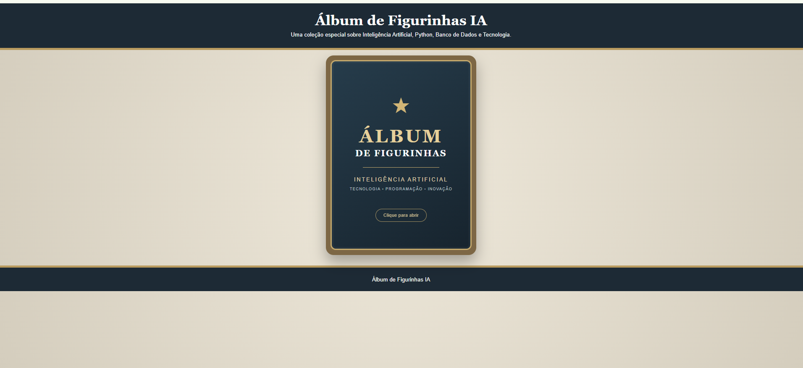
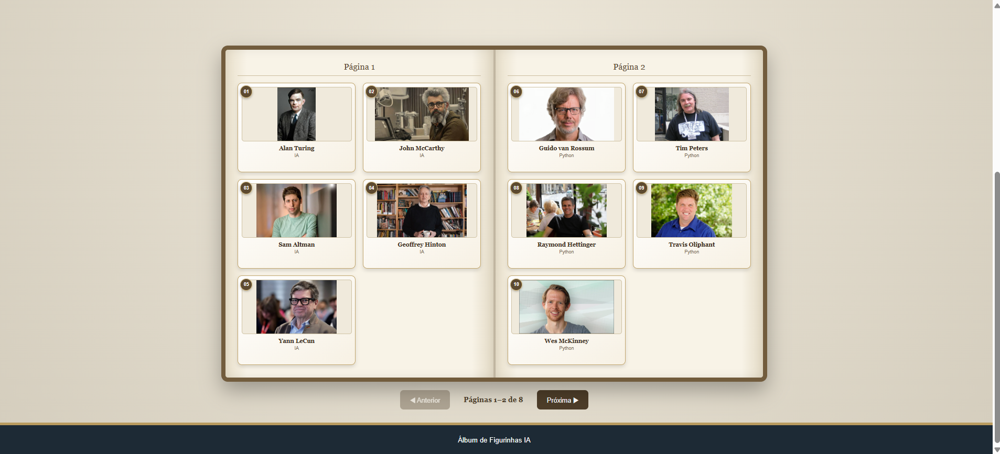
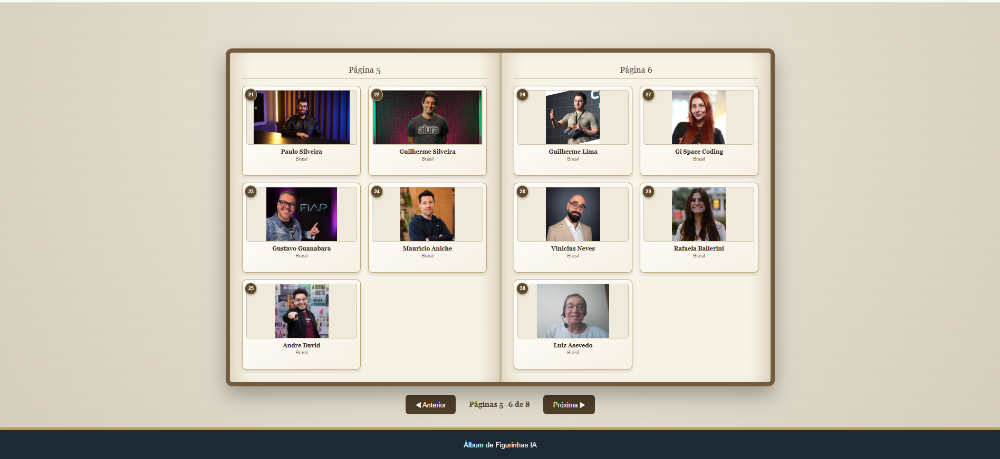

# 🏆 Álbum de Figurinhas IA

<p align="center">

  
  
  
  
  
  

</p>

<p align="center">
  <strong>Um álbum digital interativo desenvolvido com Python, FastAPI, HTML, CSS e JavaScript.</strong>
</p>

<p align="center">
  Projeto desenvolvido como prática de programação, desenvolvimento de APIs,
  integração entre Backend e Frontend e utilização de Git e GitHub.
</p>

---

## 📖 Sobre o projeto

O **Álbum de Figurinhas IA** é uma aplicação web interativa criada para reunir personagens e profissionais importantes das áreas de Inteligência Artificial, Python, Banco de Dados, Sistemas Operacionais e tecnologia no Brasil.

O projeto simula a experiência de um álbum físico de figurinhas, permitindo:

- Abrir o álbum;
- Navegar pelas páginas;
- Visualizar as figurinhas;
- Avançar e retornar entre as páginas;
- Visualizar informações dos personagens;
- Carregar imagens através de uma API;
- Fechar automaticamente o álbum ao chegar à última página;
- Retornar para a capa após o fechamento.

O projeto possui uma arquitetura simples composta por **Backend + Frontend**, permitindo praticar conceitos fundamentais de desenvolvimento web.

---

## 🎯 Objetivos

Este projeto teve como principais objetivos:

- Praticar desenvolvimento de APIs REST com FastAPI;
- Desenvolver um Frontend utilizando HTML, CSS e JavaScript;
- Trabalhar com integração entre Frontend e Backend;
- Aprender a disponibilizar imagens através de uma API;
- Trabalhar com requisições HTTP;
- Praticar manipulação do DOM com JavaScript;
- Criar animações e interações de interface;
- Organizar um projeto utilizando Git;
- Publicar e versionar o projeto no GitHub;
- Criar uma documentação profissional para portfólio.

---

# 🖼 Demonstração

## 🏠 Capa do álbum

<p align="center">
  
</p>

---

## 📖 Álbum aberto

<p align="center">
  
</p>

---

## 🃏 Coleção de figurinhas

<p align="center">
  
</p>

---

# 🃏 Coleção

O álbum possui atualmente **31 figurinhas**.

## 🤖 Inteligência Artificial

| Nº | Nome |
|---:|---|
| 01 | Alan Turing |
| 02 | John McCarthy |
| 03 | Sam Altman |
| 04 | Geoffrey Hinton |
| 05 | Yann LeCun |

## 🐍 Python

| Nº | Nome |
|---:|---|
| 06 | Guido van Rossum |
| 07 | Tim Peters |
| 08 | Raymond Hettinger |
| 09 | Travis Oliphant |
| 10 | Wes McKinney |

## 🗄 Banco de Dados

| Nº | Nome |
|---:|---|
| 11 | Edgar F. Codd |
| 12 | Larry Ellison |
| 13 | Michael Widenius |
| 14 | Salvatore Sanfilippo |
| 15 | Eliot Horowitz |

## 💻 Sistemas Operacionais

| Nº | Nome |
|---:|---|
| 16 | Linus Torvalds |
| 17 | Dennis Ritchie |
| 18 | Richard Stallman |
| 19 | Bill Gates |
| 20 | Steve Jobs |

## 🇧🇷 Tecnologia no Brasil

| Nº | Nome |
|---:|---|
| 21 | Paulo Silveira |
| 22 | Guilherme Silveira |
| 23 | Gustavo Guanabara |
| 24 | Maurício Aniche |
| 25 | Andre David |
| 26 | Guilherme Lima |
| 27 | Gi Space Coding |
| 28 | Vinicius Neves |
| 29 | Rafaela Ballerini |
| 30 | Luiz Asevedo |
| 31 | Luiz |

As figurinhas **30 e 31 representam o autor do projeto**.

---

# 🧠 Tecnologias utilizadas

| Tecnologia | Utilização |
|---|---|
| Python | Desenvolvimento do Backend |
| FastAPI | Criação da API REST |
| Uvicorn | Servidor da aplicação FastAPI |
| Pydantic | Modelagem dos dados da API |
| HTML5 | Estrutura do Frontend |
| CSS3 | Estilização, animações e layout |
| JavaScript | Lógica e interatividade |
| Fetch API | Comunicação com o Backend |
| Git | Controle de versão |
| GitHub | Hospedagem e versionamento |
| VS Code | Ambiente de desenvolvimento |

---


# 🏗 Estrutura do projeto

```text
ALBUM-FIGURINHAS-IA
│
├── Backend
│   ├── figurinhas
│   │   ├── 01-alan-turing.jpg
│   │   ├── 02-john-mccarthy.jpg
│   │   ├── 03-sam.jpg
│   │   ├── ...
│   │   ├── 29-Rafa.jpeg
│   │   ├── 30-luiz-asevedo.jpg
│   │   └── 31-Luiz.jpg
│   │
│   ├── main.py
│   └── requirements.txt
│
├── Frontend
│   ├── index.html
│   ├── app.js
│   └── style.css
│
├── assets
│   ├── capa.png
│   ├── album-aberto.png
│   └── colecao.png
│
├── .gitignore
└── README.md
```

🔄 Funcionamento do álbum

O álbum utiliza uma navegação baseada em duas páginas por abertura.

Abertura 1 → páginas 1 e 2
Abertura 2 → páginas 3 e 4
Abertura 3 → páginas 5 e 6
Abertura 4 → páginas 7 e 8

Ao chegar à última abertura, o botão de navegação muda automaticamente de:

Próxima ▶

para:

Fechar álbum

Ao clicar no botão, o álbum executa a animação de fechamento e retorna para a capa.

🔄 Comunicação entre Frontend e Backend

O Frontend realiza requisições HTTP para a API desenvolvida em FastAPI.

O Backend disponibiliza:

Dados das figurinhas;
Identificação por ID;
Imagens das figurinhas.

Fluxo simplificado:

┌──────────────────────┐
│       FRONTEND       │
│                      │
│   HTML + CSS + JS    │
└──────────┬───────────┘
           │
           │ HTTP
           ▼
┌──────────────────────┐
│       FASTAPI        │
│                      │
│       main.py        │
└──────────┬───────────┘
           │
           ▼
┌──────────────────────┐
│      FIGURINHAS      │
│                      │
│  arquivos de imagem  │
└──────────────────────┘

🚀 Como executar o projeto
1. Pré-requisitos

Tenha instalado:

Python 3.x
Git
VS Code ou outro editor de código

2. Clonar o repositório
git clone https://github.com/LuizAntonioAsevedo/Album-Figurinhas-IA.git

Entrar na pasta:

cd Album-Figurinhas-IA

⚙️ Backend

Entrar na pasta:

cd Backend
Criar ambiente virtual

Caso ainda não exista:

python -m venv .venv

Ativar o ambiente virtual

No Windows PowerShell:

.\.venv\Scripts\Activate.ps1

O terminal deverá apresentar algo semelhante a:

(.venv) PS C:\...\Album-Figurinhas-IA\Backend>
Instalar dependências
pip install -r requirements.txt

Iniciar o Backend
python -m uvicorn main:app --reload --port 8001

O servidor será disponibilizado em:

http://127.0.0.1:8001

🌐 Frontend

Abra um segundo terminal.

Entre na pasta:

cd Frontend

Execute:

python -m http.server 5500

Depois abra o navegador:

http://localhost:5500

📡 API

O Backend foi desenvolvido utilizando FastAPI.

Página inicial
GET /

Retorna uma mensagem de boas-vindas.

Listar todas as figurinhas
GET /figurinhas

Retorna a lista completa das 31 figurinhas.

Buscar uma figurinha
GET /figurinhas/{id}

Exemplo:

GET /figurinhas/1

Exibir imagem de uma figurinha
GET /figurinhas/{id}/imagem

Exemplo:

GET /figurinhas/1/imagem

Cadastrar uma nova figurinha
POST /figurinhas

Exemplo de dados:

{
  "nome": "Nome da Figurinha",
  "categoria": "Categoria"
}

Enviar imagem de uma figurinha
POST /figurinhas/{id}/imagem

Formatos aceitos pela API:

.jpg
.jpeg
.png
.webp

📖 Documentação automática da API

O FastAPI disponibiliza uma documentação interativa através do Swagger.

Com o Backend em execução, acesse:

http://127.0.0.1:8001/docs

A interface permite visualizar e testar os endpoints diretamente pelo navegador.

🎨 Recursos do Frontend

O Frontend possui:

Capa interativa;
Animação de abertura;
Animação de fechamento;
Navegação entre páginas;
Botão Anterior;
Botão Próxima;
Indicador de páginas;
Exibição das figurinhas;
Integração com a API;
Carregamento dinâmico das imagens;
Identificação da última abertura;
Botão Fechar álbum;
Retorno para a capa após o fechamento.

🧩 Lógica de navegação

A navegação foi construída para trabalhar com duas páginas simultaneamente.

Exemplo:

Página atual = 1
→ mostra páginas 1 e 2

Página atual = 3
→ mostra páginas 3 e 4

Página atual = 5
→ mostra páginas 5 e 6

Página atual = 7
→ mostra páginas 7 e 8

Quando:

Página atual + 1 >= total de páginas

o sistema identifica que chegou à última abertura.

Nesse momento:

Próxima ▶

é substituído por:

Fechar álbum

🖼 Tratamento das imagens

As imagens ficam armazenadas no diretório:

Backend/figurinhas/

A API procura automaticamente a imagem correspondente ao ID da figurinha.

Exemplos:

ID 01
↓
01-alan-turing.jpg

ID 30
↓
30-luiz-asevedo.jpg

ID 31
↓
31-Luiz.jpg

Isso permite que o Frontend solicite as imagens através da API.

🔐 CORS

O Backend possui configuração de CORS para permitir a comunicação entre:

Frontend
http://localhost:5500

e:

Backend
http://127.0.0.1:8001

Essa configuração permite que o navegador realize as requisições necessárias entre as duas aplicações durante o desenvolvimento local.

🧪 Testes realizados

Durante o desenvolvimento foram realizados testes para validar:

Inicialização do Backend;
Inicialização do Frontend;
Comunicação entre Frontend e Backend;
Listagem das figurinhas;
Carregamento das imagens;
Navegação para próxima página;
Navegação para página anterior;
Identificação da última abertura;
Alteração do botão para Fechar álbum;
Fechamento do álbum;
Retorno para a capa;
Carregamento das 31 figurinhas;
Funcionamento das imagens das figurinhas 30 e 31;
Versionamento com Git;
Publicação no GitHub.

📌 Status do projeto
✅ Versão 1.0 — Concluída

O projeto encontra-se funcional e versionado no GitHub.

Principais funcionalidades da primeira versão:

✅ Backend FastAPI
✅ API REST
✅ Frontend HTML/CSS/JavaScript
✅ 31 figurinhas
✅ Carregamento dinâmico das imagens
✅ Navegação entre páginas
✅ Animações
✅ Abertura do álbum
✅ Fechamento do álbum
✅ Retorno para a capa
✅ Documentação da API
✅ Git
✅ GitHub
✅ README profissional

🔮 Próximas melhorias

Algumas funcionalidades podem ser adicionadas em versões futuras:

Banco de dados real;
Sistema de usuários;
Login;
Cadastro de colecionadores;
Controle de figurinhas adquiridas;
Identificação de figurinhas repetidas;
Sistema de troca de figurinhas;
Busca por nome;
Filtro por categoria;
Página individual da figurinha;
Contador de figurinhas;
Percentual do álbum completo;
Efeitos sonoros;
Responsividade aprimorada para celulares;
Deploy do Backend;
Deploy do Frontend;
Banco de dados em produção.

📈 Evolução do projeto

O projeto foi desenvolvido de forma incremental:

Ideia
  ↓
Criação do Backend
  ↓
Criação da API
  ↓
Criação do Frontend
  ↓
Integração API + Frontend
  ↓
Implementação das figurinhas
  ↓
Implementação das animações
  ↓
Correção da navegação
  ↓
Correção do fechamento do álbum
  ↓
Testes
  ↓
Git
  ↓
GitHub
  ↓
README profissional
  ↓
Versão 1.0

💡 Aprendizados

Durante o desenvolvimento deste projeto foram praticados conceitos importantes de:

Backend
Python;
FastAPI;
Uvicorn;
APIs REST;
Rotas HTTP;
Pydantic;
Upload de arquivos;
Manipulação de arquivos;
CORS;
Respostas HTTP.
Frontend
HTML5;
CSS3;
JavaScript;
DOM;
Eventos;
Fetch API;
Manipulação de classes CSS;
Animações;
Controle de estado da interface;
Integração com APIs.

Desenvolvimento
Estruturação de projetos;
Ambiente virtual Python;
Organização de arquivos;
Debugging;
Testes;
Git;
GitHub;
Commits;
README e documentação.

🗂 Controle de versão

O projeto utiliza Git para controle de versão.

Exemplo de fluxo utilizado:

git status
git add .
git commit -m "mensagem do commit"
git push origin main

A branch principal utilizada é:

main

👨‍💻 Autor
Luiz Asevedo

Projeto desenvolvido como parte da jornada de aprendizado em:

Inteligência Artificial;
Programação;
Desenvolvimento Web;
Python;
APIs;
Git e GitHub.

⭐ Projeto

Este projeto representa uma etapa prática de aprendizado e evolução no desenvolvimento de aplicações utilizando Inteligência Artificial e tecnologias modernas de programação.

📄 Licença

Este projeto foi desenvolvido para fins educacionais e de portfólio.

Sinta-se à vontade para estudar a estrutura, adaptar o código e utilizar o projeto como referência para seus próprios estudos.

<p align="center"> <strong>🏆 Álbum de Figurinhas IA — Versão 1.0</strong> </p> <p align="center"> Desenvolvido com Python, FastAPI, HTML, CSS e JavaScript. </p>
